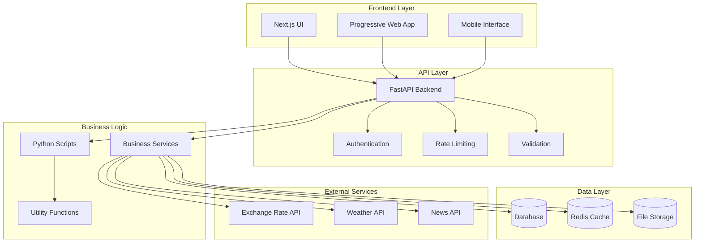
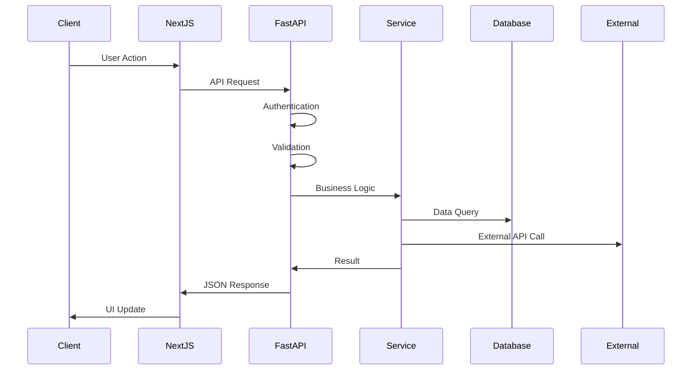
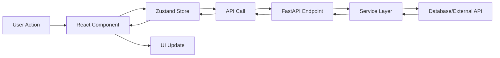
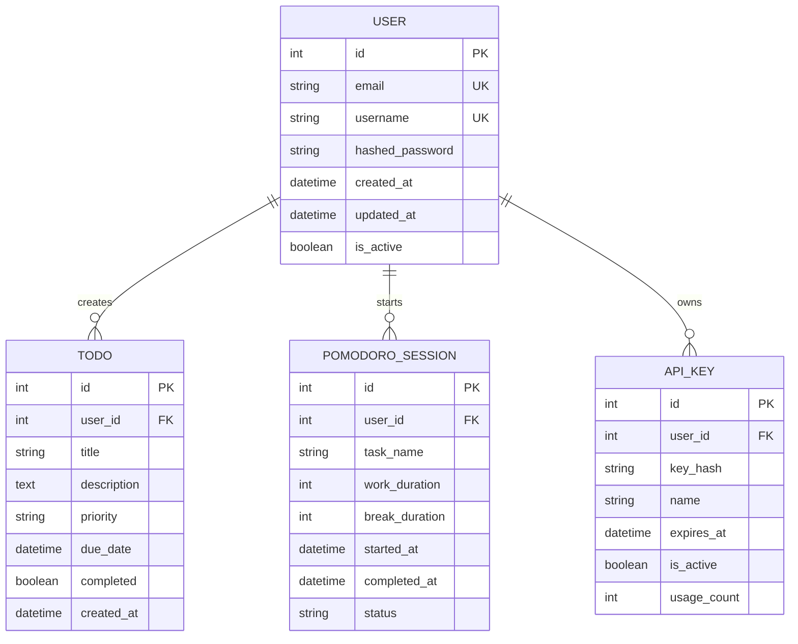
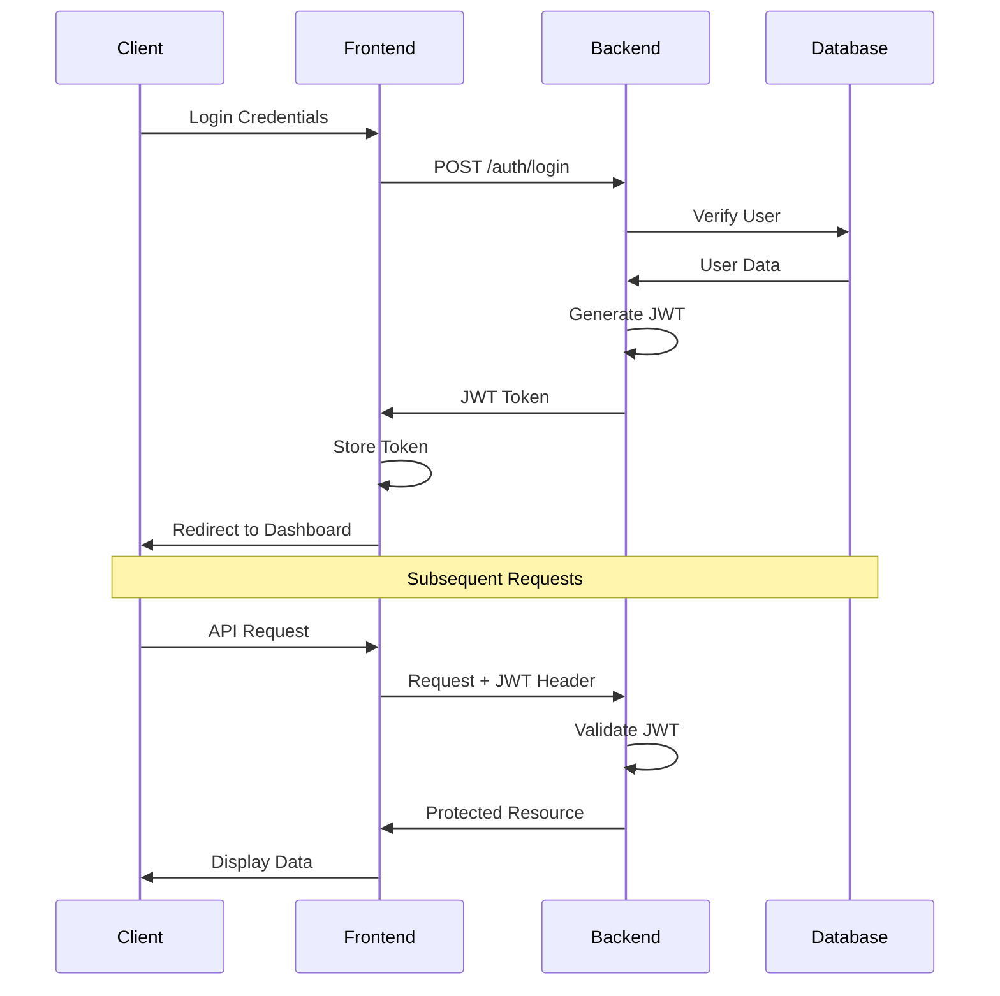
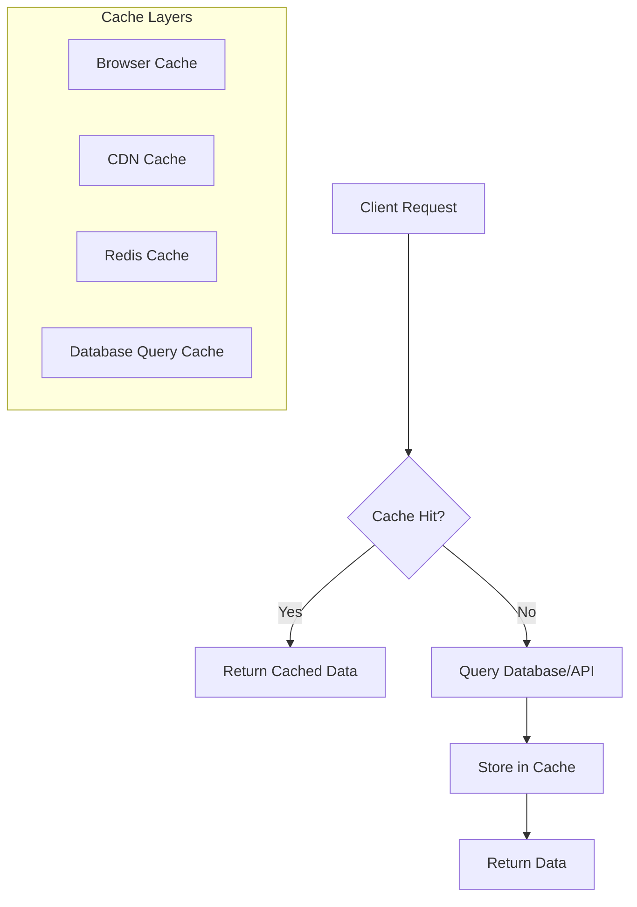
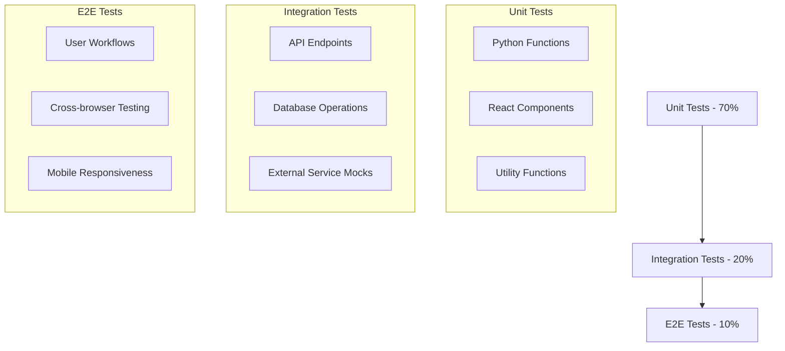
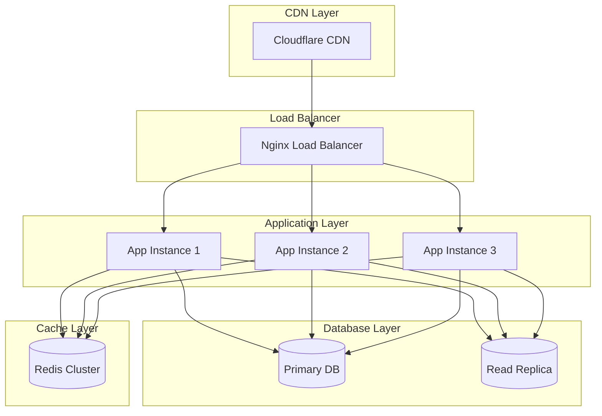
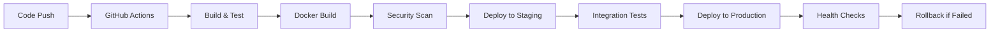
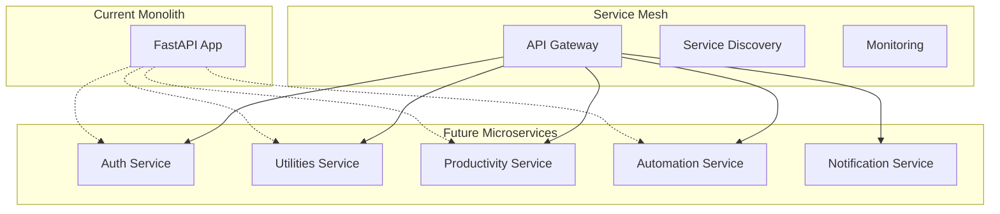

# 🏗️ Architecture Guide

This document provides a comprehensive overview of PyEveryday's system architecture, design patterns, and technical decisions.

## 🎯 Architecture Overview

PyEveryday follows a modern **microservices-inspired** architecture with a clear separation between frontend, backend, and script layers.



## 🔧 Technology Stack

### Frontend Technologies

| Technology | Purpose | Why Chosen |
|------------|---------|------------|
| **Next.js 14** | React Framework | Server-side rendering, file-based routing, optimizations |
| **TypeScript** | Type Safety | Better developer experience, fewer runtime errors |
| **Tailwind CSS** | Styling | Utility-first, responsive design, fast development |
| **React Hook Form** | Form Management | Performance, validation, developer experience |
| **Zustand** | State Management | Lightweight, TypeScript-friendly, simple API |
| **React Query** | Data Fetching | Caching, background updates, optimistic updates |

### Backend Technologies

| Technology | Purpose | Why Chosen |
|------------|---------|------------|
| **FastAPI** | Web Framework | Automatic documentation, type hints, performance |
| **Pydantic** | Data Validation | Type-safe validation, automatic JSON schema |
| **SQLAlchemy** | ORM | Database abstraction, migrations, relationships |
| **Alembic** | Database Migrations | Version control for database schema |
| **Redis** | Caching | In-memory storage, session management |
| **Celery** | Background Tasks | Async task processing, scheduling |

### Infrastructure & DevOps

| Technology | Purpose | Why Chosen |
|------------|---------|------------|
| **Docker** | Containerization | Environment consistency, easy deployment |
| **PostgreSQL** | Primary Database | ACID compliance, performance, features |
| **Nginx** | Reverse Proxy | Load balancing, SSL termination, static files |
| **GitHub Actions** | CI/CD | Automated testing, deployment, integration |
| **Vercel** | Frontend Hosting | Edge network, automatic deployments |
| **Railway/Heroku** | Backend Hosting | Easy deployment, managed infrastructure |

## 🏛️ System Design Patterns

### 1. Repository Pattern

Abstracts data access logic from business logic.

```python
# backend/app/repositories/user_repository.py
from abc import ABC, abstractmethod
from typing import List, Optional
from app.models.user import User

class UserRepository(ABC):
    @abstractmethod
    async def get_by_id(self, user_id: int) -> Optional[User]:
        pass
    
    @abstractmethod
    async def create(self, user_data: dict) -> User:
        pass

class SQLUserRepository(UserRepository):
    async def get_by_id(self, user_id: int) -> Optional[User]:
        # SQLAlchemy implementation
        pass
```

### 2. Service Layer Pattern

Encapsulates business logic and coordinates between repositories.

```python
# backend/app/services/currency_service.py
class CurrencyService:
    def __init__(self, repository: CurrencyRepository, cache: CacheService):
        self.repository = repository
        self.cache = cache
    
    async def convert(self, amount: float, from_currency: str, to_currency: str):
        # Business logic for currency conversion
        rate = await self._get_exchange_rate(from_currency, to_currency)
        return amount * rate
```

### 3. Factory Pattern

Creates objects without specifying exact classes.

```python
# backend/app/factories/script_factory.py
class ScriptFactory:
    @staticmethod
    def create_script(script_type: str, config: dict):
        if script_type == "currency_converter":
            return CurrencyConverterScript(config)
        elif script_type == "password_generator":
            return PasswordGeneratorScript(config)
        # ... more script types
```

### 4. Observer Pattern

For real-time updates and notifications.

```typescript
// ui/lib/hooks/useRealTimeUpdates.ts
export function useRealTimeUpdates() {
  useEffect(() => {
    const ws = new WebSocket('ws://localhost:8000/ws');
    
    ws.onmessage = (event) => {
      const data = JSON.parse(event.data);
      // Update UI based on real-time data
    };
    
    return () => ws.close();
  }, []);
}
```

## 🔄 Data Flow Architecture

### Request Lifecycle



### State Management Flow



## 🗄️ Database Design

### Entity Relationship Diagram



### Database Schema Principles

1. **Normalization**: Tables are normalized to 3NF to reduce redundancy
2. **Indexing**: Strategic indexing on frequently queried columns
3. **Constraints**: Foreign keys and check constraints ensure data integrity
4. **Audit Fields**: Created/updated timestamps on all entities
5. **Soft Deletes**: Important data is soft-deleted rather than physically removed

## 🔐 Security Architecture

### Authentication Flow



### Security Measures

1. **JWT Authentication**: Stateless token-based authentication
2. **Password Hashing**: bcrypt with salt for password storage
3. **CORS Configuration**: Restricted origins for API access
4. **Rate Limiting**: Prevent abuse and DoS attacks
5. **Input Validation**: Pydantic schemas validate all inputs
6. **SQL Injection Prevention**: ORM with parameterized queries
7. **XSS Protection**: Content Security Policy headers
8. **HTTPS Only**: All communication encrypted in production

## 📊 Performance Architecture

### Caching Strategy



### Performance Optimizations

1. **Frontend Optimizations**:
   - Code splitting and lazy loading
   - Image optimization with Next.js
   - Static site generation where possible
   - Service worker for offline support

2. **Backend Optimizations**:
   - Async/await for non-blocking operations
   - Connection pooling for database
   - Redis caching for frequent queries
   - Background tasks for heavy operations

3. **Database Optimizations**:
   - Strategic indexing
   - Query optimization
   - Connection pooling
   - Read replicas for scaling

## 🔌 API Design Philosophy

### RESTful Principles

1. **Resource-based URLs**: `/api/v1/utilities/currency-convert`
2. **HTTP Methods**: GET, POST, PUT, DELETE for CRUD operations
3. **Status Codes**: Meaningful HTTP status codes
4. **Stateless**: Each request contains all necessary information
5. **Cacheable**: Responses indicate if they can be cached

### API Versioning Strategy

```
/api/v1/utilities/currency-convert  # Current version
/api/v2/utilities/currency-convert  # Future version
```

- **Backward Compatibility**: v1 maintained while v2 is introduced
- **Deprecation Timeline**: 6-month notice before version removal
- **Documentation**: Clear migration guides between versions

## 🧪 Testing Architecture

### Testing Pyramid



### Testing Strategy

1. **Unit Tests**: Fast, isolated tests for individual functions
2. **Integration Tests**: Test interaction between components
3. **E2E Tests**: Test complete user workflows
4. **Performance Tests**: Load testing and benchmarking
5. **Security Tests**: Vulnerability scanning and penetration testing

## 🚀 Deployment Architecture

### Production Environment



### Deployment Pipeline



## 📈 Scalability Considerations

### Horizontal Scaling

1. **Stateless Design**: No server-side sessions, use JWT tokens
2. **Database Scaling**: Read replicas, sharding strategies
3. **Caching**: Redis cluster for distributed caching
4. **Load Balancing**: Multiple application instances
5. **CDN**: Global content distribution

### Vertical Scaling

1. **Resource Optimization**: CPU and memory profiling
2. **Database Tuning**: Query optimization, indexing
3. **Application Optimization**: Async processing, connection pooling

## 🔮 Future Architecture Plans

### Microservices Migration



### Technology Roadmap

- **Q4 2024**: Redis caching implementation
- **Q1 2025**: Microservices architecture
- **Q2 2025**: Kubernetes deployment
- **Q3 2025**: GraphQL API option
- **Q4 2025**: Real-time collaboration features

---

This architecture guide serves as a living document that evolves with the system. For questions or suggestions, please reach out to the development team.
